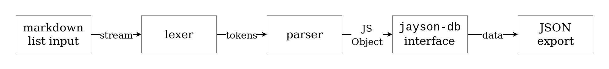

# Getting started

Hello! If you're here, that means you're interested to contribute or at least how the project's code works. Let's get things quick.

If you're more of a visual person, I've made a workflow chart of how to build the API which you can see below. It also acts as a TL;DR version of this, as well.



Let's discuss the individual components of this project. It's simple enough but a bit of a tour's still better than nothing.

## Markdown file input
In order to supply a dataset, we have a source of input. In this case, it's a simple list in Markdown. However, it does have its restrictions and it has a format to follow. Think of this as a little syntax on its own.

First, the Markdown list consists of types indicated by the Markdown subheader token (`##`) and any list items under that type is categorized as that type.

Say that we want to have a new category of dogs and add some items categorized as dogs. We will just do it like so:

```md
## Dogs
- LIST ITEM #1
- LIST ITEM #2
- LIST ITEM #3
<!-- and so on... -->
```

When the Markdown list has been resulted as a JSON file, it'll be something like this:

```json
{
    "LIST ITEM #1": {"type": "Dogs"},
    "LIST ITEM #2": {"type": "Dogs"},
    "LIST ITEM #3": {"type": "Dogs"},
    // And so on...
}
```

But it's not finished yet. Since our output has to be a JSON file of links with a related data around it, it also has a syntax to follow which is the pattern below:

```md
- [NAME](LINK) &mdash; **(PERSONAL_COMMENT)** DESCRIPTION
```

The only required parameters here is that the line should start with a Markdown list item syntax (`-`) and the Markdown link syntax with the `NAME` to be registered as the name and the `LINK` associated with the `NAME`.

Here's the detailed description of all of the parameters:

Parameter | Notes | Description
--- | --- | --- |
`NAME` | required | The name of the object. It'll also serve as an entry point for the resulting JSON file.
`LINK` | required | The link associated with the name.
`PERSONAL_COMMENT` | optional | The author's (which is yours truly, `foo-dogsquared`) personal comment. Has to be prepended by an em-dash HTML entity (`&mdash;`) and enclosed in GitHub-flavored Markdown bold syntax and a pair of parenthesis (`**()**`).
`DESCRIPTION` | optional | The description of the site/resource. Like the `PERSONAL_COMMENT`, it has to be prepended by an em-dash HTML entity (`&mdash;`) and goes for the rest of the line (that is, until a newline is encountered). Due to that behavior, if it does have a `PERSONAL_COMMENT` already, place it after that to prevent overtaking.

## Lexer

After you've built your Markdown URL list, we'll pass its contents through a lexer to create a list of tokens as indicated by the syntax we defined earlier. Here's a simple example:

```md
## TYPE1
- [NAME1](LINK1)

## TYPE2
- [NAME2](LINK2) &mdash; DESCRIPTION2
- [NAME3](LINK3) &mdash; DESCRIPTION3
- [NAME4](LINK4) &mdash; **(PERSONAL_RATING4)** DESCRIPTION4
```

We have four items which can be classified under two categories. If we passed this stream into a lexer, its result would look like this:

```json
[
    {"type": "TYPE", "data": "TYPE1"}
    {"type": "NAME", "data": "NAME1"},
    {"type": "LINK", "data": "LINK1"},
    {"type": "NEWLINE", "data": ""},
    {"type": "TYPE", "data": "TYPE2"}
    {"type": "NAME", "data": "NAME2"},
    {"type": "LINK", "data": "LINK2"},
    {"type": "MDASH_SEPARATOR", "data": ""},
    {"type": "DESCRIPTION", "data": "DESCRIPTION2"},
    // ...
    {"type": "NEWLINE", "data": ""}
]
```

You could also personally study on how the lexer works by uncommenting a specific line on [`../src/mdList.js`](../src/mdList.js) which will produce a JSON file.

## Parser

Now that we have our input tokenized by the lexer, we can parse through it to properly give the output needed. The parser simply returns a JavaScript object which is simply the data itself. You can see the result itself through the [JSON file of the API itself](../api/freebies.json) but it does not come from the parser, per se. Rather, it came from the schema validation. In order to see the raw results of the parser, you can just uncomment a certain line in [`../src/mdList.js`](../src/mdList.js) which will produce a JSON file unfiltered.

## `jayson-db` Interface

To enforce consistency of the data, I've added an additional step to it which is to add a schema. It also doubly serves as a production use case for my [`jayson-db`](https://www.npmjs.com/package/jayson-db) npm package.

`jayson-db` requires a JSON schema compliant to the [JSON Schema spec](http://json-schema.org/). You can see the schema from [`../api/freebies.schema.json`](../api/freebies.schema.json). Some shameless plugging here, if you're interested in the JSON database management system, you can check out my project, [`jayson-db`](https://www.npmjs.com/package/jayson-db).

The usage of `jayson-db` can be seen from [`../src/mdList.js`](../src/mdList.js). The exporting of JSON also occurs with `jayson-db` simply with [`jaysonDBInstance.export`](https://github.com/foo-dogsquared/jayson-db/blob/master/docs/api.md#other-methods) method.
